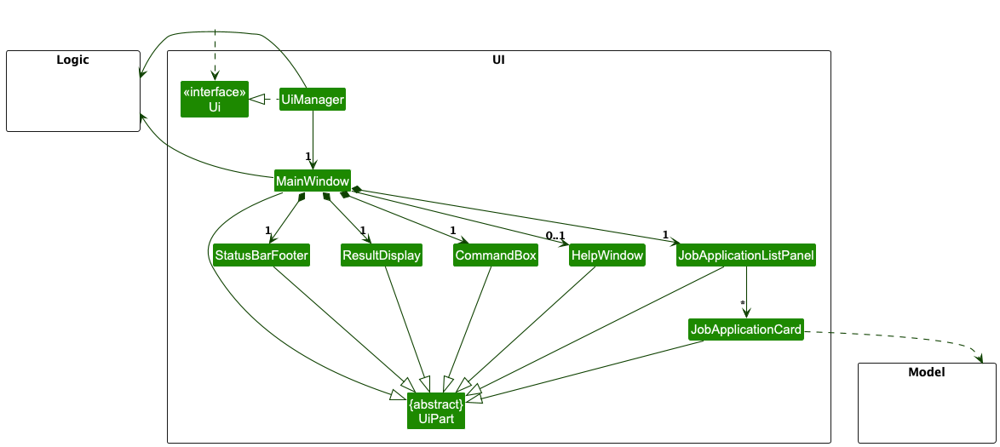
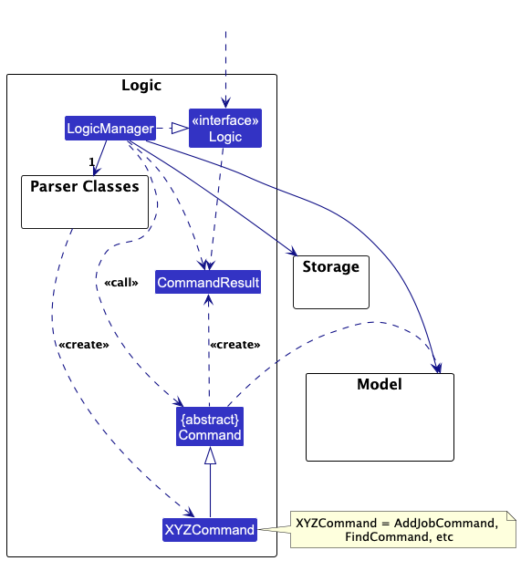
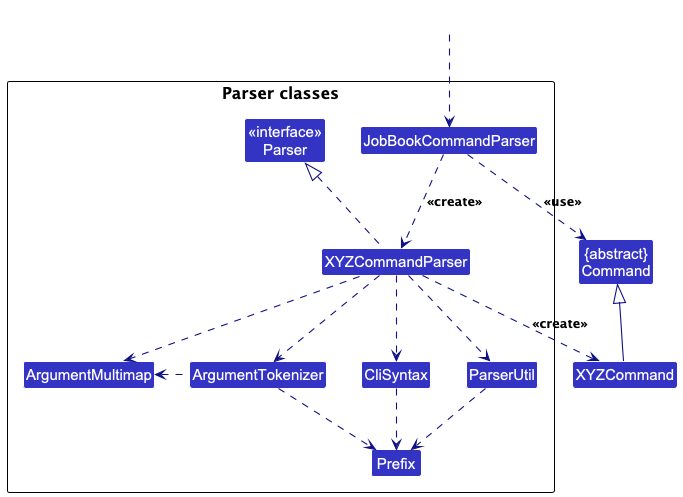
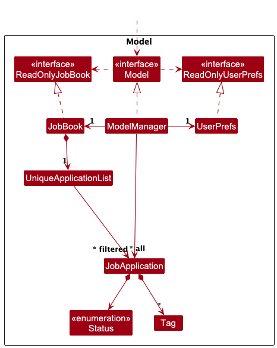
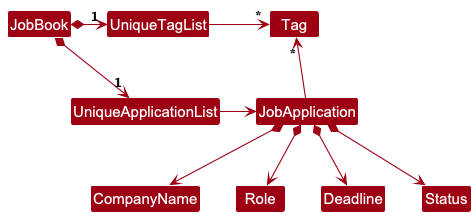
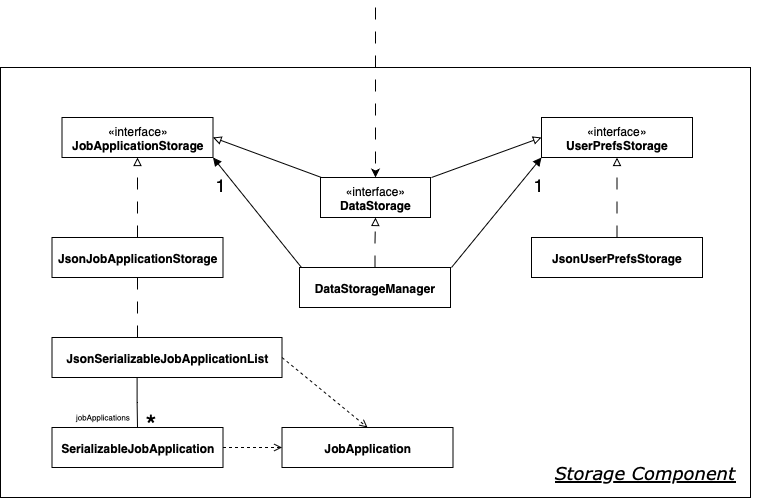
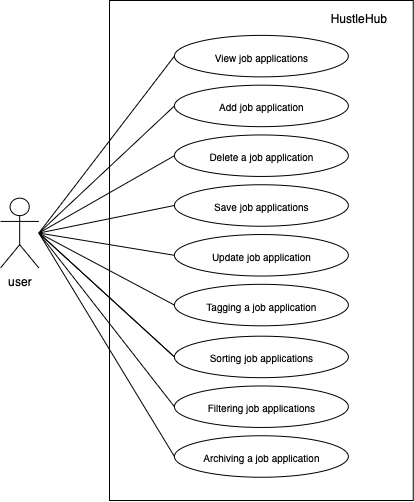

* Table of Contents
{:toc}

--------------------------------------------------------------------------------------------------------------------

## **Acknowledgements**

* This project is based on the AddressBook-Level3 project created by the [SE-EDU initiative](https://se-education.org).
* Libraries used: [JavaFX](https://openjfx.io/), [Jackson](https://github.com/FasterXML/jackson), [JUnit5](https://github.com/junit-team/junit5)

--------------------------------------------------------------------------------------------------------------------

## **Setting up, getting started**

Refer to the guide [_Setting up and getting started_](SettingUp.md).

--------------------------------------------------------------------------------------------------------------------

## **Design**

<div markdown="span" class="alert alert-primary">

:bulb: **Tip:** The `.puml` files used to create diagrams are in this document `docs/diagrams` folder. Refer to the [_PlantUML Tutorial_ at se-edu/guides](https://se-education.org/guides/tutorials/plantUml.html) to learn how to create and edit diagrams.
</div>

### Architecture


The ***Architecture Diagram*** given above explains the high-level design of the App.

Given below is a quick overview of main components and how they interact with each other.

**Main components of the architecture**

**`Main`** (consisting of classes [`Main`](https://github.com/AY2526S1-CS2103T-T11-1/tp/tree/master/src/main/java/seedu/job/Main.java) and [`MainApp`](https://github.com/AY2526S1-CS2103T-T11-1/tp/tree/master/src/main/java/seedu/job/MainApp.java)) is in charge of the app launch and shut down.
* At app launch, it initializes the other components in the correct sequence, and connects them up with each other.
* At shut down, it shuts down the other components and invokes cleanup methods where necessary.

The bulk of the app's work is done by the following four components:

* [**`UI`**](#ui-component): The UI of the App.
* [**`Logic`**](#logic-component): The command executor.
* [**`Model`**](#model-component): Holds the data of the App in memory.
* [**`Storage`**](#storage-component): Reads data from, and writes data to, the hard disk.

[**`Commons`**](#common-classes) represents a collection of classes used by multiple other components.

**How the architecture components interact with each other**

The *Sequence Diagram* below shows how the components interact with each other for the scenario where the user issues the command `delete 1`.


Each of the four main components (also shown in the diagram above),

* defines its *API* in an `interface` with the same name as the Component.
* implements its functionality using a concrete `{Component Name}Manager` class (which follows the corresponding API `interface` mentioned in the previous point.

For example, the `Logic` component defines its API in the `Logic.java` interface and implements its functionality using the `LogicManager.java` class which follows the `Logic` interface. Other components interact with a given component through its interface rather than the concrete class (reason: to prevent outside component's being coupled to the implementation of a component), as illustrated in the (partial) class diagram below.


The sections below give more details of each component.

### UI component

The **API** of this component is specified in [`Ui.java`](https://github.com/AY2526S1-CS2103T-T11-1/tp/tree/master/src/main/java/seedu/job/ui/Ui.java)



The UI consists of a `MainWindow` that is made up of parts e.g.`CommandBox`, `ResultDisplay`, `JobApplicationListPanel`, `StatusBarFooter` etc. All these, including the `MainWindow`, inherit from the abstract `UiPart` class which captures the commonalities between classes that represent parts of the visible GUI.

The `UI` component uses the JavaFx UI framework. The layout of these UI parts are defined in matching `.fxml` files that are in the `src/main/resources/view` folder. For example, the layout of the [`MainWindow`](https://github.com/AY2526S1-CS2103T-T11-1/tp/tree/master/src/main/java/seedu/job/ui/MainWindow.java) is specified in [`MainWindow.fxml`](https://github.com/AY2526S1-CS2103T-T11-1/tp/tree/master/src/main/resources/view/MainWindow.fxml)

The `UI` component,

* executes user commands using the `Logic` component.
* listens for changes to `Model` data so that the UI can be updated with the modified data.
* keeps a reference to the `Logic` component, because the `UI` relies on the `Logic` to execute commands.
* depends on some classes in the `Model` component, as it displays `JobApplication` objects residing in the `Model`.

### Logic component

**API** : [`Logic.java`](https://github.com/AY2526S1-CS2103T-T11-1/tp/tree/master/src/main/java/seedu/job/logic/Logic.java)

Here's a (partial) class diagram of the `Logic` component:



The sequence diagram below illustrates the interactions within the `Logic` component, taking `execute("delete 1")` API call as an example.


<div markdown="span" class="alert alert-info">:information_source: **Note:** The lifeline for `DeleteCommandParser` should end at the destroy marker (X) but due to a limitation of PlantUML, the lifeline continues till the end of diagram.
</div>

How the `Logic` component works:

1. When `Logic` is called upon to execute a command, it is passed to a `JobBookCommandParser` object which in turn creates a parser that matches the command (e.g., `DeleteCommandParser`) and uses it to parse the command.
1. This results in a `Command` object (more precisely, an object of one of its subclasses e.g., `DeleteJobCommand`) which is executed by the `LogicManager`.
1. The command can communicate with the `Model` when it is executed (e.g. to delete a job application).<br>
   Note that although this is shown as a single step in the diagram above (for simplicity), in the code it can take several interactions (between the command object and the `Model`) to achieve.
1. The result of the command execution is encapsulated as a `CommandResult` object which is returned back from `Logic`.

Here are the other classes in `Logic` (omitted from the class diagram above) that are used for parsing a user command:



How the parsing works:
* When called upon to parse a user command, the `JobBookCommandParser` class creates an `XYZCommandParser` (`XYZ` is a placeholder for the specific command name e.g., `AddCommandParser`) which uses the other classes shown above to parse the user command and create a `XYZCommand` object (e.g., `AddJobCommand`) which the `JobBookCommandParser` returns back as a `Command` object.
* All `XYZCommandParser` classes (e.g., `AddCommandParser`, `DeleteCommandParser`, ...) inherit from the `JobParser` interface so that they can be treated similarly where possible e.g, during testing.

### Model component
**API** : [`Model.java`](https://github.com/AY2526S1-CS2103T-T11-1/tp/tree/master/src/main/java/seedu/job/model/jobapplication/Model.java)




The `Model` component,

* stores the job book data i.e., all `JobApplication` objects (which are contained in a `UniqueJobApplicationList` object).
* stores the currently 'selected' `JobApplication` objects (e.g., results of a search query) as a separate _filtered_ list which is exposed to outsiders as an unmodifiable `ObservableList<JobApplication>` that can be 'observed' e.g. the UI can be bound to this list so that the UI automatically updates when the data in the list change.
* stores a `UserPrefs` object that represents the user's preferences. This is exposed to the outside as a `ReadOnlyUserPrefs` objects.
* stores a reference to the recently modified `JobApplication` for UI highlighting purposes.
* does not depend on any of the other three components (as the `Model` represents data entities of the domain, they should make sense on their own without depending on other components)

<div markdown="span" class="alert alert-info">:information_source: **Note:** An alternative (arguably, a more OOP) model is given below. It has a `Tag` list in the `JobBook`, which `JobApplication` references. This allows `JobBook` to only require one `Tag` object per unique tag, instead of each `JobApplication` needing their own `Tag` objects.<br>



</div>


### Storage component

**API** : [`DataStorage.java`](https://github.com/AY2526S1-CS2103T-T11-1/tp/blob/master/src/main/java/seedu/job/storage/DataStorage.java)



The `Storage` component manages **persistence (saving and loading)** for job application and user preference data, using the JSON format.

<details>
    <summary><b>Technical Remarks</b></summary>

* For easy customisation/replacement, `JobApplicationStorage` and `UserPrefStorage` are left as interfaces to abstract the storage component.

* `DataStorageManager` can be treated as a `JobApplicationStorage` or `UserPrefStorage` object as it implements both interfaces.

* Depends on some classes in the `Model` component such as `JobApplication` as it saves or loads objects from said component.
* `JsonSerializableJobApplicationList & SerializableJobApplication` have a dependency with on JobApplications as both classes possess logic to [deserialize/serialize](#glossary) `JobApplication` objects.

</details>

---

### Common classes

Classes used by multiple components are in the `seedu.job.commons` package.

--------------------------------------------------------------------------------------------------------------------

## **Implementation**

This section describes some noteworthy details on how certain features are implemented.

### Card Highlighting Feature

#### Implementation

The card highlighting mechanism provides visual feedback to users by highlighting recently modified job application cards with an elegant white-to-blue gradient. This feature is implemented across the Model, Logic, and UI layers.

**Architecture Components:**

The implementation involves:
* `Model` & `ModelManager`: Stores the recently modified `JobApplication`
* `Logic` & `LogicManager`: Exposes the recently modified application to the UI
* Command classes: Set or clear the recently modified application based on operation type
* `JobApplicationListPanel`: Tracks and refreshes the view when highlighting changes
* `JobApplicationCard`: Conditionally applies CSS highlighting class
* `MainWindow`: Synchronizes highlight state after each command execution

**Key Operations:**

* `Model#setRecentlyModifiedApplication(JobApplication)` — Sets the application to be highlighted
* `Model#getRecentlyModifiedApplication()` — Returns the currently highlighted application
* `JobApplicationListPanel#setRecentlyModifiedApplication(JobApplication)` — Updates the panel and refreshes the view

**Command Behavior:**

Commands are categorized into two groups:

1. **Modifying Commands** (set highlight):
   - `AddJobCommand` - Highlights the newly added application
   - `UpdateJobCommand` - Highlights the updated application  
   - `TagJobCommand` - Highlights the tagged application
   - `UntagJobCommand` - Highlights the untagged application

2. **Non-Modifying Commands** (clear highlight):
   - `DeleteJobCommand` - Clears all highlights
   - `FilterCommand` - Clears all highlights
   - `SortCommand` - Clears all highlights
   - `FindCommand` - Clears all highlights

**UI Implementation:**

The `JobApplicationCard` constructor accepts an `isRecentlyModified` boolean parameter. When `true`, it adds the CSS class `"recently-modified"` to the card pane, which applies:
* White-to-blue gradient background (left to right)
* Enhanced blue-tinted shadow for subtle emphasis
* Maintains consistent padding and border radius

**Example Usage Scenario:**

Step 1. User executes `tag 1 t/urgent`. The `TagJobCommand` calls `model.setRecentlyModifiedApplication(taggedJob)`.

Step 2. `MainWindow#executeCommand()` calls `jobApplicationListPanel.setRecentlyModifiedApplication(logic.getRecentlyModifiedApplication())`.

Step 3. The panel refreshes, and the card at index 1 is rendered with the highlight gradient.

Step 4. User executes `filter s/APPLIED`. The `FilterCommand` calls `model.setRecentlyModifiedApplication(null)`.

Step 5. The panel refreshes, and all cards are rendered without highlighting.

#### Design Considerations:

**Aspect: Where to store the recently modified application:**

* **Alternative 1 (current choice):** Store in Model layer
  * Pros: Centralized state management, accessible to all components
  * Cons: Adds additional state to Model

* **Alternative 2:** Store in UI layer only
  * Pros: Simpler model, UI-specific concern stays in UI
  * Cons: Difficult to synchronize across command executions, loss of state on view refresh

**Aspect: How to identify recently modified applications:**

* **Alternative 1 (current choice):** Use object equality comparison
  * Pros: Simple, works with immutable command pattern
  * Cons: Requires exact object reference match

* **Alternative 2:** Use unique identifier (e.g., company + role)
  * Pros: More robust to object recreation
  * Cons: More complex logic, potential edge cases with duplicates

### Job Application Uniqueness

#### Design Decision

**What makes a job application unique?**

A job application in HustleHub is uniquely identified by the combination of:
- **Company Name** (case-sensitive)
- **Role** (case-sensitive)

The system enforces that no two job applications can have the same company name and role combination.

**Implementation:**

```java
public final String getUniqueKey() {
    return this.companyName + "|" + this.role;
}

public boolean isSameJobApplication(JobApplication otherJobApplication) {
    return otherJobApplication != null
        && otherJobApplication.getUniqueKey().equals(this.getUniqueKey());
}
```

#### Why This Choice?

**Requirements Analysis:**

1. **Target User Behavior**: Computing students typically apply to each company for a specific role once per application cycle
2. **Simplicity**: Students think in terms of "I applied to Google for SWE" - a natural mental model
3. **Prevents Accidental Duplicates**: Guards against users inadvertently adding the same application multiple times
4. **Data Integrity**: Ensures clean, organized tracking without confusing duplicate entries in the UI

**Alternative Considerations:**

We considered but rejected these alternatives:

| Uniqueness Criteria | Reason for Rejection |
|---------------------|---------------------|
| Company + Role + Deadline | Deadline changes during updates would cause unexpected conflicts; doesn't match user mental model |
| Company + Role + Tags | Tags are optional and mutable; would force users to add tags to differentiate positions; breaks tag flexibility |
| Company + Role + Status | Status changes as application progresses; would prevent natural status updates |

#### Pros and Cons

**Advantages ✅**

1. **Simple and Predictable**
   - Users understand: "One application per company-role pair"
   - Clear error messages: "You already have an application for this position"
   - No surprise conflicts from field updates

2. **Minimal Edge Cases**
   - Only checks 2 required fields (no null handling needed)
   - Both fields are conceptually immutable (company name and role title don't change)
   - Consistent behavior across add and update operations

3. **Clean User Experience**
   - No confusing duplicate "Google | Software Engineer" entries in the UI
   - Tags remain purely organizational (can be added/removed freely)
   - Natural workflow for status/deadline updates

4. **Flexible Within Constraints**
   - Users can differentiate similar positions in the role field:
     * "Software Engineer - Backend Team"
     * "Software Engineer (Cloud Infrastructure)"
     * "SWE - Seattle Office"

**Limitations ❌**

1. **Re-applications Require Deletion**
   - If rejected and reapplying later, user must delete old entry first
   - Workaround: Keep old entry and update deadline/status
   - Future enhancement: Add "clone" or "reapply" command

2. **Same Role at Multiple Teams**
   - Cannot track "Google SWE - Cloud" and "Google SWE - Search" as separate entries with identical role names
   - Workaround: Differentiate in the role field itself
   - Encourages explicit role specification, improving data clarity

3. **No Built-in Historical Tracking**
   - Previous applications to the same company-role are lost if deleted
   - Workaround: Update status to REJECTED instead of deleting
   - Future enhancement: Add archiving feature

#### Design Considerations

**Aspect: What fields determine uniqueness?**

* **Alternative 1 (current choice):** Company + Role only
  * Pros: Simple mental model, prevents accidental duplicates, minimal edge cases
  * Cons: Cannot track re-applications or multiple teams for same role title

* **Alternative 2:** Company + Role + Deadline
  * Pros: Allows re-applications with different deadlines
  * Cons: Updating deadline causes conflicts; same deadline = artificial conflict

* **Alternative 3:** Company + Role + Tags
  * Pros: Flexible differentiation using existing tag system
  * Cons: Tags become mandatory for duplicates; mutable tags break uniqueness; confusing UX

**Aspect: Should tags affect uniqueness?**

* **Alternative 1 (current choice):** Tags are purely organizational
  * Pros: Tags remain flexible and optional; no unexpected conflicts from tag changes
  * Cons: Cannot use tags to differentiate positions

* **Alternative 2:** Include tags in uniqueness check
  * Pros: Allows tracking multiple same-titled positions
  * Cons: Removing tags creates conflicts; forces tag usage; changes tag purpose from organizational to structural

**Conclusion:** The company + role uniqueness provides the best balance of simplicity, usability, and alignment with user needs. The limitations can be addressed through user guidance (role naming conventions) and future enhancements (clone/archive features).

---

### Tag Management Feature

#### Implementation

The tag management feature allows users to add and remove tags from job applications. Tags are implemented as immutable `Tag` objects with validation constraints.

**Tag Constraints:**
* Must be a single word (no spaces)
* Maximum 30 characters
* Can contain letters, numbers, and up to 2 special characters from: `-`, `.`, `@`, `#`, `_`, `+`
* Each application can have up to 3 tags

**Key Classes:**
* `Tag`: Represents an immutable tag with validation
* `TagJobCommand`: Adds tags to a job application
* `UntagJobCommand`: Removes tags from a job application

**Tag Command Implementation:**

The `TagJobCommand` creates a new `JobApplication` instance with the updated tag set, following the immutable pattern:

1. Retrieves the target application from the filtered list
2. Validates tag capacity (max 3 tags)
3. Creates new application with `createTaggedJob()` method
4. Calls `model.setJobApplication()` to replace the old application
5. Sets the newly tagged application as recently modified

**Untag Command Implementation:**

Similar to tag command but removes tags:

1. Retrieves the target application
2. Validates that all tags to remove exist
3. Creates new application with `createUntaggedJob()` method
4. Replaces and highlights the application

**Error Handling:**

The feature provides clear, actionable error messages:
* **Tag capacity exceeded**: Explains the limit and suggests using `untag` first
* **Tag doesn't exist**: Clarifies which tags don't exist and suggests checking current tags
* **Invalid tag format**: Explains the validation rules with examples

### [Proposed] Job Application Expiry

#### Requirements

This feature automatically marks job applications as STALE when they have not been edited for 14 days.

- Add a new status value to the existing status enum: `STALE`.
- Add a new field to `JobApplication`: `lastEditedTime` (type: `java.time.LocalDateTime`). This field records the last time the application was modified by any modifying command (add, update, tag, untag).
- On application start-up, HustleHub must perform a one-time calculation over all persisted job applications and set any application whose `lastEditedTime` is 14 full days (>= 14 days) in the past to have status `STALE`.

Notes / assumptions:
- If a persisted application does not contain a `lastEditedTime` (older data format), treat its `lastEditedTime` as the time the application was loaded on startup (i.e., `LocalDateTime.now()` at load). This avoids accidentally marking legacy data as stale unless the user actually hasn't edited it since file creation — see migration notes below.
- `STALE` is intended to be an additional, non-terminal status used to surface older, unattended applications. It does not replace `REJECTED` and may coexist with other workflows. By default the startup scan will set `STALE` for any application regardless of its current status, except where doing so would conflict with business rules you prefer (see alternatives below). If you want `REJECTED` or other terminal statuses to be exempt, specify and we can update the algorithm accordingly.

#### Data model changes

1. Status enum (in `JobApplication` or `Status` enum type)
   - Add: `STALE`

2. `JobApplication` fields
   - Add: `private final LocalDateTime lastEditedTime;`
   - Constructor(s) and factory methods must accept and persist `lastEditedTime`.
   - All modifying operations (add, update, tag, untag) must set `lastEditedTime = LocalDateTime.now()` for the newly created `JobApplication` instance.
   - `SerializableJobApplication` (storage layer) must be updated to read/write `lastEditedTime` (ISO-8601 format via `LocalDateTime.toString()` / `LocalDateTime.parse(...)`). When parsing older JSON that lacks the field, fall back to `LocalDateTime.now()` (see migration note).

#### Startup calculation (where to run)

Run the staleness calculation once during application startup after the persisted data is read from disk but before the `ModelManager` is constructed or before the `Logic`/`Ui` components are initialized and shown. Concretely, a good spot is inside `MainApp.init()` after `storage.readDataFile()` returns the `List<JobApplication>` and before calling `new ModelManager(...)`.

Example high-level algorithm (pseudo-code):

```java
// in MainApp.init() after reading applicationList from storage
LocalDateTime now = LocalDateTime.now();
Duration staleThreshold = Duration.ofDays(14);
List<JobApplication> migrated = new ArrayList<>();
for (JobApplication app : applicationList) {
   LocalDateTime lastEdited = app.getLastEditedTime();
   if (lastEdited == null) {
      // migration fallback: treat as just-loaded
      lastEdited = now;
   }
   if (Duration.between(lastEdited, now).compareTo(staleThreshold) >= 0) {
      if (app.getStatus() != JobApplication.Status.STALE) {
         JobApplication staleApp = app.withStatus(JobApplication.Status.STALE)
                                .withLastEditedTime(app.getLastEditedTime());
         migrated.add(staleApp);
         continue;
      }
   }
   migrated.add(app);
}
// use `migrated` list to build ModelManager / JobBook
```

Notes:
- The sample uses immutable-style `withStatus(...)` / `withLastEditedTime(...)` helpers that return a new `JobApplication` instance; implement equivalent constructors if your codebase uses a different pattern.
- Running the migration in `MainApp.init()` ensures the UI and logic always see the canonical (post-migration) state and that `ModelManager` / `JobBook` invariants (e.g., uniqueness) are preserved.

#### Persistence and migration

- Update `SerializableJobApplication` / `JsonSerializableJobApplicationList` to include `lastEditedTime` when serializing.
- For backwards compatibility, when deserializing JSON that lacks `lastEditedTime`, set `lastEditedTime = LocalDateTime.now()` (or optionally `Files.getLastModifiedTime(path)` if you prefer file time semantics). Document this behavior in the release notes so users understand the migration effect.

#### Command behavior changes

- Every command that modifies a job application must update `lastEditedTime` to `LocalDateTime.now()` on the newly created `JobApplication` object that replaces the old one. This includes: `AddJobCommand`, `UpdateJobCommand`, `TagJobCommand`, `UntagJobCommand` (and any future modifying commands such as `Clone`, `Archive`, etc.).

#### Edge cases & testing

- Timezones: Use `LocalDateTime` consistently across serialization and comparisons; if your app will run across machines in different timezones, consider `ZonedDateTime` or persist UTC (`Instant`) instead. For single-user desktop app, `LocalDateTime` is acceptable.
- Clock skew: If tests or users modify system clocks, behavior will follow the system clock. Consider adding a clock abstraction for testability.
- Tests to add:
  - Unit: `isStale(lastEditedTime, now)` boundary tests (13d23h59m -> false; 14d00h00m -> true).
  - Integration: Persisted JSON without `lastEditedTime` -> migration does not accidentally mark as stale unless it truly is.

#### Alternatives / configuration

- Make the stale threshold configurable (user preference or config.json) instead of fixed 14 days.
- Exempt certain statuses (e.g., `REJECTED`) from being set to `STALE` on startup. If desired, update the startup condition to only mark applications whose status is in a configurable set (default: APPLIED, INPROGRESS).

--------------------------------------------------------------------------------------------------------------------

## **Documentation, logging, testing, configuration, dev-ops**

* [Documentation guide](Documentation.md)
* [Testing guide](Testing.md)
* [Logging guide](Logging.md)
* [Configuration guide](Configuration.md)
* [DevOps guide](DevOps.md)

--------------------------------------------------------------------------------------------------------------------

## **Appendix: Requirements**

### Product scope

**Target user profile**:

* is a **computing student** actively applying for internships or full-time positions
* needs to **manage multiple job applications** simultaneously across different companies
* values **speed and organization** in tracking application statuses, deadlines, and details
* prefers **desktop applications** over mobile or web-based solutions
* is **comfortable with command-driven interfaces** (CLI) for faster interaction 
* seeks **a streamlined tool** for tracking applications, deadlines, and interview stages
* is **tech-savvy** and appreciates keyboard-optimized workflows like Notion, GitHub, or Google Calendar  

**Value proposition**:  
HustleHub empowers computing students to **efficiently manage their job application process** — providing a fast, keyboard-optimized interface to track applications, deadlines, statuses, and tags all in one place, helping students stay organized during their job search.


### User stories

Priorities: High (must have) - `* * *`, Medium (nice to have) - `* *`, Low (unlikely to have) - `*`

| Priority | As a …​                    | I want to …​                                                                                              | So that I can…​                                                           |
|----------|----------------------------|-----------------------------------------------------------------------------------------------------------|---------------------------------------------------------------------------|
| `* * *`  | student                    | view the list of all my job applications                                                                  | see everything I'm tracking in one place                                  |
| `* * *`  | student                    | add job application details (company name, role, application status, deadline)                            | track multiple applications efficiently                                   |
| `* * *`  | student                    | delete a job application                                                                                  | remove entries I no longer want to track                                  |
| `* * *`  | student                    | view details of a specific job application                                                                | review all the information I've saved about that application              |
| `* *`    | student                    | update job application details                                                                            | keep my records current as my applications progress                       |
| `* *`    | student                    | sort applications by deadline                                                                             | prioritize applications that need attention first                         |
| `* *`    | student                    | sort applications by company name                                                                         | organize my applications alphabetically                                   |
| `* *`    | student                    | sort applications by status                                                                               | group applications by their current stage                                 |
| `* *`    | student                    | search for job applications by keyword                                                                    | quickly find a specific application                                       |
| `* *`    | student                    | filter applications by company name                                                                       | focus on applications from a particular employer                          |
| `* *`    | student                    | filter applications by status                                                                             | view only applications at a specific stage                                |
| `* *`    | student                    | add custom tags to job applications                                                                       | categorize them by priority, location, or other criteria                  |
| `* *`    | student                    | remove tags from applications                                                                             | update categorization as my needs change                                  |
| `* *`    | student                    | see recently modified applications highlighted                                                            | quickly identify which applications I just updated                        |
| `* *`    | student                    | set and view application deadlines with date and time                                                     | manage my time effectively and submit applications on time                |
| `* *`    | student                    | track application status (applied, in progress, rejected)                                                 | know the current stage of each application                                |
| `* *`    | student with many applications | clear the application list                                                                             | start fresh when needed                                                   |
| `* *`      | new user                   | see usage instructions                                                                                    | learn how to use the app when I forget commands                           |
| `* *`      | student                    | have data automatically persisted                                                                         | recover my application data after closing the app                         |
| `*`      | student                    | export my job application data                                                                            | back up my data or share it with career counselors                        |
| `*`      | student                    | archive old or rejected applications                                                                      | keep my active list clean without losing historical data                  |
| `*`      | student                    | add notes to applications                                                                                 | remember specific details about each position or company                  |
| `*`      | student                    | track interview rounds completed                                                                          | assess my application progress at a detailed level                        |
| `*`      | student                    | store recruiter contact information                                                                       | easily reach out for follow-up questions or updates                       |
| `*`      | student                    | track application sources (LinkedIn, company website, referral)                                           | know where my opportunities are coming from                               |
| `*`      | student                    | store links to job postings                                                                               | quickly access the original application details                           |
| `*`      | student                    | categorize applications by job type (software engineering, data science)                                  | focus on specific career paths                                            |
| `*`      | student                    | see how many days remain until each deadline                                                              | prioritize urgent applications                                            |
| `*`      | student                    | track when I applied to each position                                                                     | know when to follow up with companies                                     |
| `*`      | student                    | set priority levels for applications                                                                      | focus my efforts on high-priority opportunities                           |
| `*`      | student                    | view application status history                                                                           | track how my applications have progressed over time                       |
| `*`      | student                    | track rejection reasons                                                                                   | learn from each experience and improve future applications                |
| `*`      | student                    | track multiple interview stages for each application                                                      | easily identify where I am in the hiring process                          |
| `*`      | student                    | track the number of applications submitted per time period                                                | measure my job search activity and adjust my strategy                     |


### Use cases

_For all use cases below, the **System** is `HustleHub` and the **Actor** is the `user`, unless specified otherwise._



### UC01 - View all job applications

**MSS**
1. User requests to list all job applications.
2. System displays all job applications.
3. System displays a success message.

   Use case ends.

### UC02 - Add a job application

**Preconditions**
* User has viewed the list of applications (UC01).

**MSS**
1. User inputs job application details.
2. System adds the job application.
3. System displays the newly added application.

   Use case ends.

**Extensions**

* 1a. System detects invalid details.
  * 1a1. System shows an error message.
    
    Use case ends.

* 1b. System detects a duplicate job application.
  * 1b1. System shows an error message.

  Use case ends.

**Guarantees**
* System state remains unchanged if addition fails.

### UC03 - Delete a job application

**Preconditions**
* User has viewed the list of applications (UC01).

**MSS**
1. User requests to delete a specific application.
2. System deletes the application.
3. System displays confirmation message.

   Use case ends.

**Extensions**

* 1a. System detects an invalid index.
  * 1a1. System shows an error message.
    
    Use case ends.

* 1b. The specified application does not exist.
  * 1b1. System shows an error message.

  Use case ends.

**Guarantees**
* System state remains unchanged if deletion fails.

### UC04 - Update a job application

**Preconditions**
* User has viewed the list of applications (UC01).

**MSS**
1. User requests to update specific fields of an application.
3. System updates the application.
4. System displays the updated application.

   Use case ends.

**Extensions**

* 1a. The specified application does not exist.
  * 1a1. System shows an error message.

  Use case ends.

* 1b. No fields provided to update.
  * 1b1. System shows an error message.

  Use case ends.

* 1c. Updated details would create a duplicate.
  * 1c1. System shows duplicate application error message.

  Use case ends.

* 1d. Invalid field format provided.
  * 1d1. System shows an error message.

  Use case ends.

**Guarantees**
* Original application data is preserved if update fails.

### UC05 - Adding tags

**Preconditions**
* User has viewed the list of applications (UC01).
* There is minimally one job application in HustleHub.

**MSS**
1. User requests to add tags to a specific job application.
2. System adds the tags to the job application.
3. System displays the updated application.
4. System displays a success message.

   Use case ends.

**Extensions**

* 1a. System detects an invalid tag.
  * 1a1. System shows an error message.
    
    Use case ends.

**Guarantees**
* Original tags are preserved if addition fails.

### UC06 - Removing tags

**Preconditions**
* User has viewed the list of applications (UC01).
* There is minimally one job application in HustleHub.

**MSS**
1. User requests to delete tags.
2. System deletes the tags.
3. System displays the updated application.
4. System displays a success message.

   Use case ends.

**Extensions**

* 1a. One or more specified tags do not exist.
  * 1a1. System shows an error message.

  Use case ends.

**Guarantees**
* Original tags are preserved if removal fails.

### UC07 - Sort job applications

**Preconditions**
* User has viewed the list of applications (UC01).
* There is minimally one job application in HustleHub.

**MSS**
1. User requests to sort applications by a specific criterion.
2. System sorts the applications.
3. System displays the sorted list.

   Use case ends.

**Extensions**

* 1a. Invalid sort criterion provided.
  * 1a1. System shows an error message.

  Use case ends.

### UC08 - Filter job applications

**Preconditions**
* User has viewed the list of applications (UC01).
* There is minimally one job application in HustleHub.

**MSS**
1. User requests to filter applications by specific criteria.
2. System filters the applications matching the criteria.
3. System displays the filtered list.
4. System displays a success message.

   Use case ends.

**Extensions**

* 1a. Invalid filter criteria provided.
  * 1a1. System shows an error message.

  Use case ends.

* 2a. No applications match the filter criteria.
  * 2a1. System displays empty list.

  Use case continues from step 3.

**Guarantees**
* Only applications matching the criteria are displayed.
* Original application data remains unchanged.

### UC09 - Search for job applications

Similar to UC08 but we are searching via keywords instead.

**MSS**
1. User provides search keywords.
2. System searches for matching applications.
3. System displays all matching applications.
4. System displays a success message.

   Use case ends.

**Extensions**

* 1a. System detects no keywords.
  * 1a1. System displays an error message.

  Use case ends.

* 2a. No applications match the search keywords.
  * 2a1. System displays empty list.

  Use case continues from step 3.

**Guarantees**
* Only applications fully matching the keywords are displayed.
* Original application data remains unchanged.

### UC10 - View help information

**MSS**
1. User requests help information.
2. System displays usage instructions.

   Use case ends.

**Guarantees**
* Help information is always available.
* System state remains unchanged.

---


### Non-Functional Requirements

1. **Platform Compatibility**: Should work on any _mainstream OS_ as long as it has Java `17` or above installed.
2. **Performance - Capacity**: Should be able to hold up to 1000 job applications without noticeable sluggishness in performance for typical usage.
3. **Performance - Responsiveness**: A user with above average typing speed for regular English text (i.e. not code, not system admin commands) should be able to accomplish most tasks faster using commands than using the mouse.
4. **Performance - Response Time**: All commands should complete within 2 seconds for typical operations.
5. **Data Integrity**: The system should enforce data integrity whereby no two job applications share the same combination of company name and role.
6. **Usability**: The user interface should be intuitive enough for computing students familiar with CLI tools to use without extensive training.
7. **Reliability - Data Persistence**: All modifications to job application data should be automatically saved to prevent data loss in the event of an application crash or closure.
8. **Usability - Error Handling**: Error messages should be clear and actionable, guiding users to correct their input.

### Glossary

* **Job Application**: A record containing company name, role, application status (APPLIED, INPROGRESS, REJECTED), deadline (date and time), and optional tags. Each application is uniquely identified by the combination of company name and role.
* **Mainstream OS**: Windows, Linux, Unix, MacOS
* **Tag**: A short label (1-30 characters) used to categorize job applications, containing letters, numbers, and optionally special characters. Tags are purely organizational and do not affect application uniqueness.
* **Recently Modified Application**: The job application that was last modified by an add, update, tag, or untag operation, visually highlighted in the UI
* **Serialization**: The process to convert complex objects (like JobApplication) into JSON format for storage
* **Filtered List**: A subset of job applications displayed based on search, filter, or sort criteria
* **Immutable Pattern**: A design pattern where objects cannot be modified after creation; modifications create new objects instead
* **Unique Key**: The combination of company name and role that uniquely identifies a job application. No two applications can have the same unique key.

--------------------------------------------------------------------------------------------------------------------

## **Appendix: Instructions for manual testing**

Given below are instructions to test the app manually.

<div markdown="span" class="alert alert-info">:information_source: **Note:** These instructions only provide a starting point for testers to work on;
testers are expected to do more *exploratory* testing.

</div>

### Launch and shutdown

1. Initial launch

   1. Download the jar file and copy into an empty folder

   1. Double-click the jar file or run `java -jar hustlehub.jar` from the terminal<br>
      Expected: Shows the GUI with sample job applications. The window size may not be optimum.

1. Saving window preferences

   1. Resize the window to an optimum size. Move the window to a different location. Close the window.

   1. Re-launch the app by double-clicking the jar file.<br>
       Expected: The most recent window size and location is retained.

### Adding a job application

1. Adding a job application with all required fields

   1. Test case: `add n/Google r/Software Engineer s/APPLIED d/2025-12-31T23:59`<br>
      Expected: New application is added to the list. The card is highlighted with a white-to-blue gradient. Details of the added application shown in the result display.

   1. Test case: `add n/Google r/Software Engineer s/APPLIED d/2025-12-31T23:59 t/urgent t/remote`<br>
      Expected: Similar to previous, but with tags displayed on the card.

   1. Test case: `add n/Google r/Software Engineer s/INVALID d/2025-12-31T23:59`<br>
      Expected: No application is added. Error message about invalid status shown.

   1. Test case: `add n/Google r/Software Engineer`<br>
      Expected: No application is added. Error message about missing required fields shown.

### Deleting a job application

1. Deleting a job application while all applications are shown

   1. Prerequisites: List all applications using the `list` command. Multiple applications in the list.

   1. Test case: `delete 1`<br>
      Expected: First application is deleted from the list. Details of the deleted application shown in the result display. Any highlighting is cleared.

   1. Test case: `delete 0`<br>
      Expected: No application is deleted. Error message about invalid index shown.

   1. Other incorrect delete commands to try: `delete`, `delete x`, `...` (where x is larger than the list size)<br>
      Expected: Similar to previous.

### Updating a job application

1. Updating one or more fields of a job application

   1. Prerequisites: At least one application in the list.

   1. Test case: `update 1 s/INPROGRESS`<br>
      Expected: Status of first application updated to INPROGRESS. Card is highlighted. Updated details shown.

   1. Test case: `update 1 n/Facebook r/Data Scientist d/2026-01-15T12:00`<br>
      Expected: Company name, role, and deadline of first application updated. Card is highlighted.

   1. Test case: `update 1 t/priority t/urgent`<br>
      Expected: Tags of first application replaced with "priority" and "urgent". Card is highlighted.

   1. Test case: `update 1`<br>
      Expected: No update occurs. Error message about needing at least one field shown.

### Tagging a job application

1. Adding tags to a job application

   1. Prerequisites: At least one application in the list with fewer than 3 tags.

   1. Test case: `tag 1 t/urgent`<br>
      Expected: Tag "urgent" added to first application. Card is highlighted. Success message shown.

   1. Test case: `tag 1 t/priority t/remote`<br>
      Expected: Both tags added if total doesn't exceed 3. Card is highlighted.

   1. Test case: `tag 1 t/invalid tag` (with space)<br>
      Expected: No tag added. Error message about tag format shown.

   1. Test case: Tag an application that already has 3 tags<br>
      Expected: No tag added. Error message about maximum tags shown.

### Finding job applications

1. Finding applications by keyword

   1. Prerequisites: At least a few applications in the list with different company names and roles.

   1. Test case: `find Google`<br>
      Expected: All applications with "Google" in either company name or role shown. Highlighting cleared. Success message with number of applications found.

   1. Test case: `find Software Engineer`<br>
      Expected: All applications containing both "Software" and "Engineer" in company name or role shown.

   1. Test case: `find XYZ123NonExistent`<br>
      Expected: Empty list shown. Message indicates 0 applications found.

   1. Test case: `find` (without keywords)<br>
      Expected: Error message about invalid command format. List remains unchanged.

### Untagging a job application

1. Removing tags from a job application

   1. Prerequisites: At least one application in the list with one or more tags.

   1. Test case: `untag 1 t/urgent`<br>
      Expected: Tag "urgent" removed from first application if it exists. Card is highlighted. Success message shown.

   1. Test case: `untag 1 t/priority t/remote`<br>
      Expected: Both tags removed if they exist. Card is highlighted.

   1. Test case: `untag 1 t/nonexistent`<br>
      Expected: No tag removed. Error message indicating the tag doesn't exist on this application.

   1. Test case: Untag an application with no tags<br>
      Expected: Error message indicating no tags to remove.

   1. Test case: `untag 0 t/urgent`<br>
      Expected: Error message about invalid index shown.

### Listing all applications

1. Viewing all job applications after filtering/finding

   1. Prerequisites: Filter or find applications to show a subset.

   1. Test case: `list`<br>
      Expected: All applications shown again. Highlighting cleared. Success message indicates total number of applications.

   1. Test case: Execute `list` when all applications already shown<br>
      Expected: No change. Success message still shown.

### Filtering and Sorting

1. Filtering applications

   1. Test case: `filter s/APPLIED`<br>
      Expected: Only applications with APPLIED status shown. Highlighting cleared.

   1. Test case: `filter s/INPROGRESS`<br>
      Expected: Only applications with INPROGRESS status shown.

   1. Test case: `filter s/REJECTED`<br>
      Expected: Only applications with REJECTED status shown.

   1. Test case: `filter s/STALE` (if expiry feature implemented)<br>
      Expected: Only applications with STALE status shown.

   1. Test case: `filter t/urgent`<br>
      Expected: Only applications tagged with "urgent" shown.

   1. Test case: `filter d/2025-12-31`<br>
      Expected: Only applications with deadline on or after 2025-12-31 shown.

   1. Test case: `filter s/APPLIED t/urgent`<br>
      Expected: Only applications that are both APPLIED status AND tagged "urgent" shown.

   1. Test case: `filter none`<br>
      Expected: All applications shown again.

   1. Test case: `filter s/INVALID`<br>
      Expected: Error message about invalid status value.

2. Sorting applications

   1. Test case: `sort deadline`<br>
      Expected: Applications sorted by deadline ascending. Highlighting cleared.

   1. Test case: `sort deadline desc`<br>
      Expected: Applications sorted by deadline descending (latest first).

   1. Test case: `sort company`<br>
      Expected: Applications sorted by company name ascending (A-Z).

   1. Test case: `sort company desc`<br>
      Expected: Applications sorted by company name descending (Z-A).

   1. Test case: `sort role asc`<br>
      Expected: Applications sorted by role ascending (A-Z).

   1. Test case: `sort status`<br>
      Expected: Applications sorted by status (alphabetical order).

   1. Test case: `sort invalid`<br>
      Expected: Error message about invalid sort field.

### Viewing help

1. Accessing help information

   1. Test case: `help`<br>
      Expected: Help window opens showing command usage instructions. Link to user guide displayed.

   1. Test case: Execute `help` when help window already open<br>
      Expected: Help window gains focus (brought to front).

### Exiting the application

1. Closing the application

   1. Test case: `exit`<br>
      Expected: Application closes gracefully. All data saved.

   1. Test case: Close window using window close button (X)<br>
      Expected: Same as `exit` command - application closes and data saved.

### Saving data

1. Dealing with missing/corrupted data files

   1. Simulate missing file: Delete `data/JobApplications.json` before launching<br>
      Expected: App launches with sample data.

   1. Simulate corrupted file: Edit `data/JobApplications.json` with invalid JSON<br>
      Expected: App launches with empty data or sample data, depending on implementation.

   1. Test automatic saving: Add an application, close app, relaunch<br>
      Expected: Added application persists across sessions.
