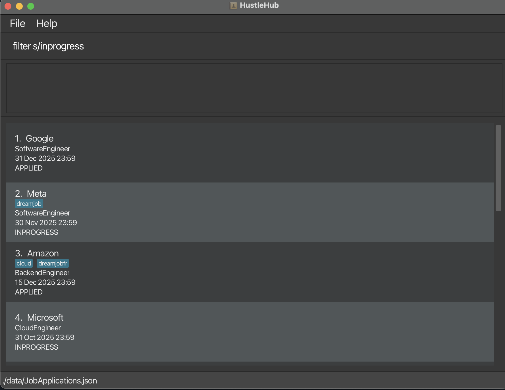
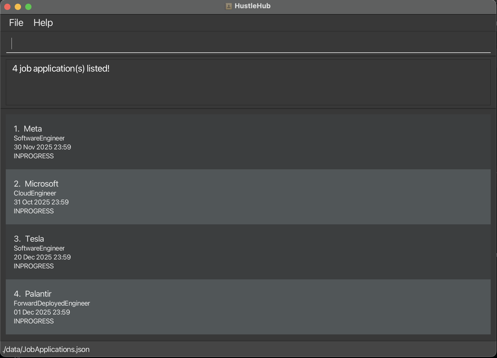

HustleHub is a **desktop application** for computing students keeping track of multiple internship/job applications who prefer using CLI over GUI. The product will provide computing students an easy way to visualise, add and modify their job application details to multiple positions at multiple companies

* Table of Contents
{:toc}

--------------------------------------------------------------------------------------------------------------------

## Quick start

1. Ensure you have Java `17` or above installed in your Computer. 
   **Mac users:** Ensure you have the precise JDK version prescribed [here](https://se-education.org/guides/tutorials/javaInstallationMac.html).

1. Download the latest `.jar` file from [here](https://github.com/se-edu/addressbook-level3/releases).

1. Copy the file to the folder you want to use as the _home folder_ for your AddressBook.

1. Open a command terminal, `cd` into the folder you put the jar file in, and use the `java -jar addressbook.jar` command to run the application. 
   A GUI similar to the below should appear in a few seconds. Note how the app contains some sample data. 
   

1. Type the command in the command box and press Enter to execute it. e.g. typing **`help`** and pressing Enter will open the help window. 
   Some example commands you can try:

   * `list` : Lists all applications.

   * `add n/Microsoft r/Cloud engineer s/INPROGRESS d/2025-10-31T23:59` : Adds a application for `Microsoft` to the Application Book.

   * `delete 3` : Deletes the 3rd application shown in the current list.

   * `update 1 s/INPROGRESS d/2027-01-15T17:00` : Updates the 1st application's status and deadline.

   * `sort deadline` : Sorts the applications by **deadline** (ascending by default). You can also sort by `company` or `role`, and use `desc`. e.g. `sort company desc`

   * `clear` : Deletes all applications.

   * `exit` : Exits the app.

1. Refer to the [Features](#features) below for details of each command.

--------------------------------------------------------------------------------------------------------------------

## Features

**:information_source: Notes about the command format:** 

* Words in `UPPER_CASE` are the parameters to be supplied by the user. 
  e.g. in `add n/NAME`, `NAME` is a parameter which can be used as `add n/John Doe`.

* Items in square brackets are optional. 
  e.g `n/NAME [t/TAG]` can be used as `n/John Doe t/friend` or as `n/John Doe`.

* Items with `…`​ after them can be used multiple times including zero times. 
  e.g. `[t/TAG]…​` can be used as ` ` (i.e. 0 times), `t/friend`, `t/friend t/family` etc.

* Parameters can be in any order. 
  e.g. if the command specifies `n/NAME p/PHONE_NUMBER`, `p/PHONE_NUMBER n/NAME` is also acceptable.

* Extraneous parameters for commands that do not take in parameters (such as `help`, `list`, `exit` and `clear`) will be ignored. 
  e.g. if the command specifies `help 123`, it will be interpreted as `help`.

* If you are using a PDF version of this document, be careful when copying and pasting commands that span multiple lines as space characters surrounding line-breaks may be omitted when copied over to the application.

--------------------------------------------------------------------------------------------------------------------

## Command summary

### General Commands

Command  | Description                                  | Format
-------- |----------------------------------------------|------------------
[**help**](#viewing-help--help) | Displays how to use all commands in a window |`help`
[**exit** ](#exiting-the-program--exit-exit)| Exits the program                            |`exit`

### Application Management
Command  | Description                                      | Format
-------- |--------------------------------------------------|------------------
[**add**](#adding-a-person-add) | Adds a job application to HustleHub              | `add n/COMPANY_NAME r/ROLE s/STATUS d/DEADLINE [t/TAG]…​`
[**update**](#updating-a-job-application-update) | Updates an existing job application's details    | `update INDEX [n/COMPANY_NAME] [r/ROLE] [s/STATUS] [d/DEADLINE] [t/TAG]…​`
[**delete**](#deleting-a-application--delete) | Deletes a job application given its index number | `delete INDEX`
[**find**](#finding-job-applications-find) | Finds job applications by company name           | `find KEYWORD [MORE_KEYWORDS]`
[**filter**](#filtering-job-applications-filter) | Filters job applications by a property           | `filter FLAG/KEYWORD`
[**sort**](#sorting-the-applications--sort) | Sorts the job applications in HustleHub          |`sort FIELD`

### Tag Management

Command  | Description                                   | Format
-------- |-----------------------------------------------|------------------
[**tag**](#adding-tags-tag) | Adds new tags to a specified job application  |`tag JOB_APPLICATION_INDEX t/NEW_TAG`
[**untag**](#removing-tags-untag) | Removes tags from a specified job application |`untag JOB_APPLICATION_INDEX t/NEW_TAG`
---

## General Commands

### Viewing help : `help`

Shows a message explaining how to access the help page.

Format: `help`

Result for `help`:

### Exiting the program : `exit`

Exits the program.

Format: `exit`

### Saving data

HustleHub data is automatically saved after any command that changes the data. There is no need to save manually.

### Editing the data file

HustleHub data is saved automatically as a JSON file `[JAR file location]/data/JobApplications.json`. Advanced users are welcome to update data directly by editing that data file.

:exclamation: **Caution:**
If your changes to the data file makes its format invalid, HustleHub will discard all data and start with an empty data file at the next run. Hence, it is recommended to take a backup of the file before editing it. 
Furthermore, certain edits can cause the HustleHub to behave in unexpected ways (e.g., if a value entered is outside of the acceptable range). Therefore, edit the data file only if you are confident that you can update it correctly.

---

## General Commands

### Adding a person: `add`

Adds a person to the address book.

Format: `add n/NAME p/PHONE_NUMBER e/EMAIL a/ADDRESS [t/TAG]…​`

:bulb: **Tip:**
A person can have any number of tags (including 0)

Examples:
* `add n/Microsoft r/Cloud engineer s/INPROGRESS d/2025-10-31T23:59`
* `add n/Microsoft r/Cloud engineer s/INPROGRESS d/2025-10-31T23:59 t/Low-pay t/Good-boss`

### Deleting a application : `delete`

Deletes the specified application from the application book.

Format: `delete INDEX`

* Deletes the application at the specified `INDEX`.
* The index refers to the index number shown in the displayed application list.
* The index **must be a positive integer** 1, 2, 3, …​

Examples:
* `list` followed by `delete 2` deletes the 2nd application in the application book.
* After filtering the list, `delete 1` deletes the 1st application in the currently displayed results

### Finding job applications: `find`

Sorts the current list of applications by a chosen field, in ascending or descending order.

**Format:** `sort FIELD [ORDER]`  
- **FIELD**: `company` \| `role` \| `deadline`  
- **ORDER** (optional): `asc` \| `desc` (default: `asc`)

**Notes**
- Sorting is **stable** and **case-insensitive** for text fields (`company`, `role`).
- When sorting by **deadline**, missing/invalid deadlines appear **last** for `asc` (and **first** for `desc`).

**Examples**
- `sort deadline`  
- `sort company desc`  
- `sort role asc`
Finds job applications whose company's name fully matches any of the given keywords.

Format: `find KEYWORD [MORE_KEYWORDS]`

#### Find Restrictions
1. The search is not case-insensitive. e.g `tiktok` will match `TikTok`

2. The order of the keywords does not matter. e.g. `American Airlines` will match `Airlines American`

3. Only the company name is searched.

4. Job Application copmanies matching at least one keyword will be returned (i.e. `OR` search).
  e.g. `Morgan` will return `J.P. Morgan`, `Morgan Stanley`

Examples:

* `find morgan` 
  * Returns `Morgan Stanley` and `J.P. Morgan Chase`

* `find Tiger America` 
  * Returns `Tiger Management`, `Bank of America` 

  
Before:

After:

### Filtering Job Applications: `filter`

Filters the list of job applications based on a single field: **Company Name**, **Role**, **Status**, or **Application Deadline**.

Format: `filter FLAG/KEYWORD`

or, to remove all filters: `filter none`

#### **Filtering Rules**

1. **Company Name (`n/`)** and **Role (`r/`)**: Matches if the `KEYWORD` is **contained** in the respective field
   (e.g., `n/backend` matches "Backend Engineer").
    * The search is **case-insensitive**.

2. **Application Status (`s/`)**: Matches an exact, **case-insensitive** status.
    * Valid keywords are: **APPLIED**, **INPROGRESS**, or **REJECTED**.

3. **Application Deadline (`d/`)**: Matches the exact date only, ignoring the time component.
    * The date must be in the **`yyyy-MM-dd`** format (e.g., `2025-12-31`).

#### **Examples**

* `filter n/Google`
    * Returns applications where the company name contains "Google" (e.g., "Google LLC", "Googler Inc.").

* `filter r/engineer`
    * Returns applications for roles containing "engineer" (e.g., "Software Engineer", "Data Engineering Intern").

* `filter s/applied`
    * Returns applications with the status "APPLIED".

* `filter d/2025-10-20`
    * Returns applications with an application deadline on October 20, 2025.

* `filter none`
    * Removes all current filters and shows the complete list of job applications.

* `filter s/inprogress` returns the 4 jobs that currently have status 'INPROGRESS'

Before: `filter s/inprogress`

      
After filtering: `INPROGRESS`

### Sorting the applications : `sort`

Sorts the specified application from the application book.

Format: `sort`

* No parameters.
* Applies to the current application list (including any active filters).
* The sorted order is shown immediately in the UI.

Before:

After:

### Updating a job application: `update`

Updates the details of an existing job application in HustleHub.

Format: `update INDEX [n/COMPANY_NAME] [r/ROLE] [s/STATUS] [d/DEADLINE] [t/TAG]…​`

* Updates the job application at the specified `INDEX`.
* The index refers to the index number shown in the displayed application list.
* The index **must be a positive integer** 1, 2, 3, …​
* At least one of the optional fields must be provided.
* Existing values will be overwritten by the input values.
* When updating tags with `t/TAG`, all existing tags will be replaced by the new tags specified.
* You can remove all tags by typing `t/` without specifying any tags after it.

:exclamation: **Caution:**

* Deadline cannot be in the past. Please provide a future date and time in the format `yyyy-MM-ddTHH:mm`.
* Updating company name and/or role may result in duplicate applications if the combination already exists.
* Valid status values are: `APPLIED`, `INPROGRESS`, or `REJECTED` (case-insensitive).

**Examples:**

* `update 1 s/INPROGRESS` - Updates the status of the 1st application to INPROGRESS.
* `update 2 r/Senior Engineer d/2027-01-15T17:00` - Updates the role and deadline of the 2nd application.
* `update 3 n/Apple r/iOS Developer s/APPLIED d/2026-06-30T23:59 t/remote t/urgent` - Updates all fields of the 3rd application.
* `update 1 t/` - Removes all tags from the 1st application.

Before:

After updating with `update 2 s/INPROGRESS d/2027-01-15T17:00 t/priority t/urgent`:

--------------------------------------------------------------------------------------------------------------------

## Tag Management

### Adding tags: `tag`

Adds tags to a job application.

Format: `tag JOB_APPLICATION_INDEX t/TAG...`

Input restrictions:
1. A `TAG` must be between 1 to 30 characters long, it cannot be blank.
2. A `TAG` allows letters, numbers, and up to 2 hyphens, underscores, full-stops, at signs, plus signs, and minus signs.
3. A `TAG` cannot have spaces.

Examples:
- `tag 1 t/C#`
- `tag 2 t/6-Month t/C++ t/@HQ`
- `tag 3 t/python_v3.12 t/BlockChain t/FinTech` 

Before:

After tagging:

### Removing tags: `untag`

Removes tags to a job application.

Format: `untag JOB_APPLICATION_INDEX t/TAG...`

Input restrictions:
1. A `TAG` must be between 1 to 30 characters long, it cannot be blank.
2. A `TAG` allows letters, numbers, and up to 2 hyphens, underscores, full-stops, ampersands, plus signs, and minus signs.
3. A `TAG` cannot have spaces.
4. Inputted tags must already exist.

Examples:
- `untag 1 t/SQL`
- `untag 2 t/6-Month t/C++`
- `untag 3 t/python_v3.12 t/BlockChain t/Full-Stack`

Before:

After untagging:

---

## FAQ

**Q**: How do I transfer my data to another Computer? 
**A**: Install the app in the other computer and overwrite the empty data file it creates with the file that contains the data of your previous AddressBook home folder.

--------------------------------------------------------------------------------------------------------------------

## Known issues

1. **When using multiple screens**, if you move the application to a secondary screen, and later switch to using only the primary screen, the GUI will open off-screen. The remedy is to delete the `preferences.json` file created by the application before running the application again.
2. **If you minimize the Help Window** and then run the `help` command (or use the `Help` menu, or the keyboard shortcut `F1`) again, the original Help Window will remain minimized, and no new Help Window will appear. The remedy is to manually restore the minimized Help Window.
